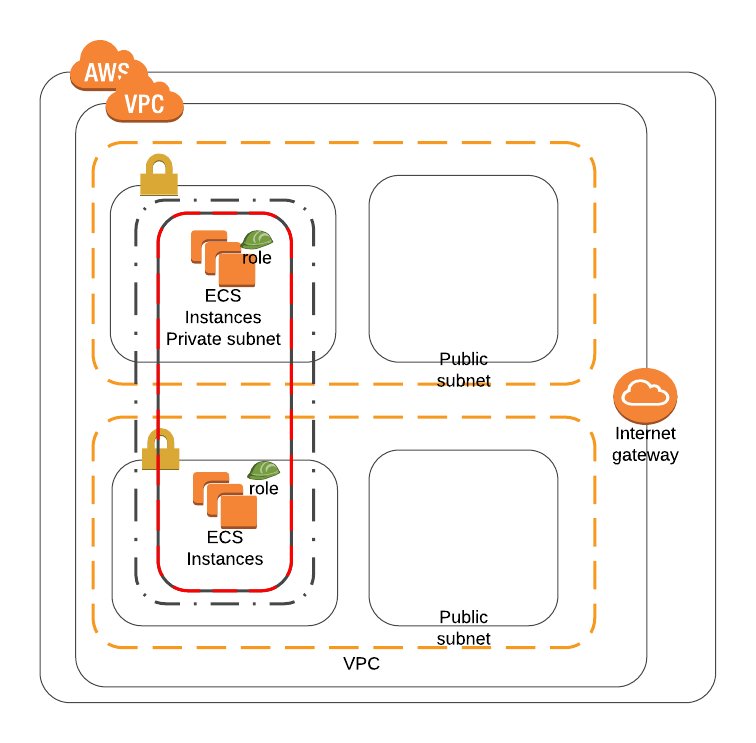

# ECS Cluster

* [Parameters](#Parameters)
* [ECS](#ECS)
* [Output](#Output)

## Parameters

* **InstanceType**: EC2 Instance type for cluster.
* **KeyPair**: Key Pair Name for EC2 access.
* **ECSAMI**: AMI for ECS optimized.

## ECS
Amazon Elastic Container Service (Amazon ECS) is a highly scalable, high-performance container orchestration service that supports Docker containers and allows you to easily run and scale containerized applications on AWS. Amazon ECS eliminates the need for you to install and operate your own container orchestration software, manage and scale a cluster of virtual machines, or schedule containers on those virtual machines.

## Output
* ECS cluster
* ECS IAM Role
* ECS instance profile
* ECS Container instance

