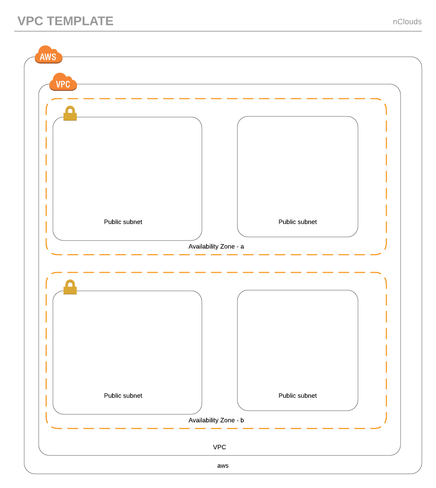

# Network

* [VPC](#VPC)
* [Parameters](#Parameters)
* [Output](#Output)
* [SecurityGroups](#SecurityGroups)
* [SGOutput](#SGOutput)

# VPC
Amazon Virtual Private Cloud (Amazon VPC) lets you provision a logically isolated section of the AWS Cloud where you can launch AWS resources in a virtual network that you define. You have complete control over your virtual networking environment, including selection of your own IP address range, creation of subnets, and configuration of route tables and network gateways. You can use both IPv4 and IPv6 in your VPC for secure and easy access to resources and applications.

## Parameters

* **CIDR Block**: IP range in CIDR notation (10.10.0.0/16).

## Output
* 1 Private subnets in 1 availability zone.
* 1 Public subnets in 1 availability zone.
* 1 Internet gateway and its attachment.
* 1 Nat gateways and its attachment.
*   Route tables and associations.
* 1 Elastic IPs for the NAT gateway.
* Necessary access control list for each subnet.

# SecurityGroups
AWS security groups and cloud security. AWS security groups (SGs) are associated with EC2 instances and provide security at the protocol and port access level. Each security group – working much the same way as a firewall – contains a set of rules that filter traffic coming into and out of an EC2 instance.

## SGOutput
* Load balancer security group for HTTP and HTTPS ports.
* Container instances for ECS cluster.
